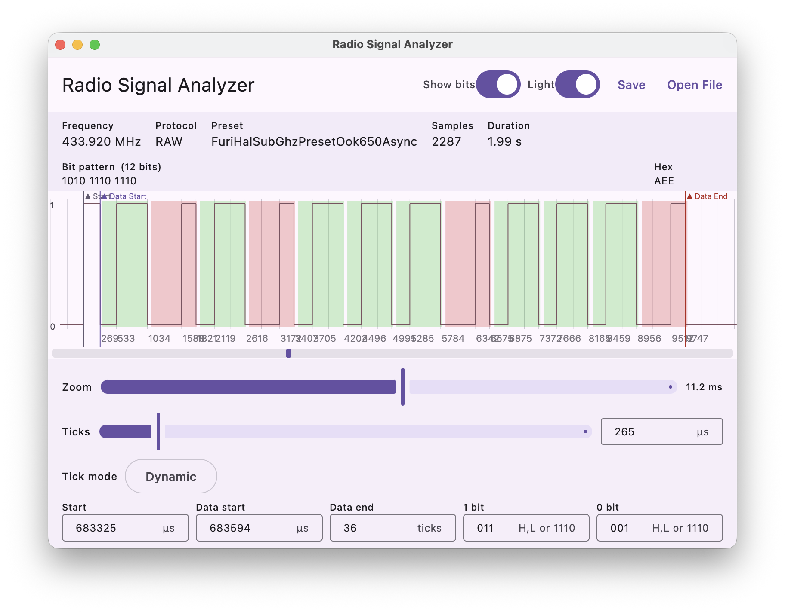

# Radio Signal Analyzer

A desktop tool for loading, visualizing, and analyzing **Flipper Zero SubGhz RAW `.sub` files**.



## Features

- **Open or drag-and-drop** `.sub` files onto the signal graph
- **Interactive waveform** — zoom (slider) and pan (drag or scrollbar)
- **Configurable tick marks** — static (evenly spaced) or dynamic (snapped to signal transitions)
- **Markers** — place Start, Data Start, and Data End markers via long-press context menu or text input
- **Bit decoding** — configurable 1-bit and 0-bit patterns in comma format (`3,1`) or binary string (`1110`); decoded bits and hex value shown in the info panel
- **Bit overlay** — color-coded rectangles behind each decoded bit (green = 1, red = 0)
- **Sidecar files** — analysis settings are saved to a `.sam` file next to the `.sub`; drag-dropping or opening the `.sam` restores everything automatically
- **Light / dark mode** with preference saved between sessions

## Usage

1. Open a `.sub` file via **Open File** or drag it onto the window
2. Use the zoom slider and drag to navigate the signal
3. Long-press on the graph to place markers
4. Set tick interval and mode, then configure bit patterns to decode the signal
5. Click **Save** to write a `.sam` sidecar — next time you open the `.sub` (or the `.sam` directly), all settings are restored

## Build & Run

```shell
# Run in development mode
./gradlew :composeApp:run

# Run with hot reload
./gradlew :composeApp:runHot

# Run tests
./gradlew :composeApp:jvmTest

# Build macOS .dmg
./gradlew :composeApp:macApp
```

## Project Structure

All application code lives in `composeApp/src/jvmMain/`:

| File | Purpose |
|------|---------|
| `main.kt` | Entry point, window, file picker |
| `App.kt` | Root composable, top app bar |
| `SignalGraphView.kt` | Waveform canvas, drag-and-drop, scrollbar |
| `GraphControls.kt` | Zoom, tick, marker, and pattern controls |
| `InfoPanel.kt` | File metadata, decoded bits, hex output |
| `MainViewModel.kt` | All app state and business logic |
| `SubFileParser.kt` | `.sub` file parser |
| `SamFileParser.kt` | `.sam` sidecar read/write |
| `TickStrategy.kt` | Static and dynamic tick algorithms |
| `BitDecodePattern.kt` | Pattern string validation and conversion |

Built with **Kotlin Multiplatform** + **Compose Multiplatform** targeting Desktop (JVM).
